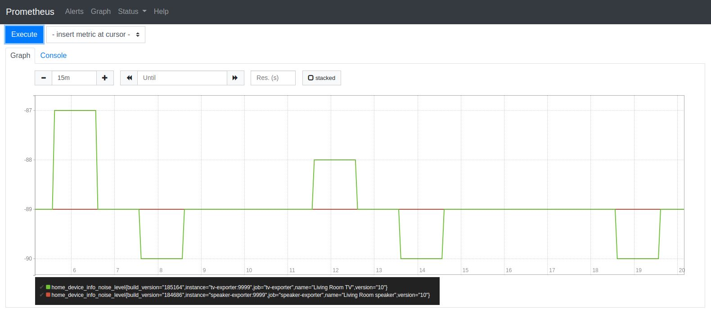

# Google Home Exporter



Currently only reports `home_device_info_noise_level`, `home_device_info_signal_level` and `home_device_info_uptime`

```
# HELP home_device_info_noise_level TBD
# TYPE home_device_info_noise_level gauge
home_device_info_noise_level -89
# HELP home_device_info_signal_level TBD
# TYPE home_device_info_signal_level gauge
home_device_info_signal_level -49
# HELP home_device_info_uptime TBD
# TYPE home_device_info_uptime gauge
home_device_info_uptime 34250.670738
# HELP home_exporter_build_info A metric with a constant '1' value labeled by OS version, Go version, and the Git commit of the exporter
# TYPE home_exporter_build_info counter
home_exporter_build_info{git_commit="",go_version="go1.12.5",os_version=""} 1
# HELP home_exporter_start_time Exporter start time in Unix epoch seconds
# TYPE home_exporter_start_time gauge
home_exporter_start_time 1.578172839e+09
```

## Run

The Exporter exposes `:9999` and `/metrics` by default

### Docker
```bash
docker run \
--rm --interactive --tty \
--name=${DEVICE} \
--publish=${PORT}:9999
dazwilkin/home-exporter:bdbd1e40faf8dc3a98c65e1412c122a33e5e0a3c
  --device=192.168.86.25:8008 \
  --endpoint=:9999 \
  --metricsPath=/metrics
```
You can then browse `http://localhost:9999/metrics`

### Docker Compose

Includes the Exporter, Prometheus and cAdvisor

```bash
docker-compose up
```
Then:

+ [Exporter](http://localhost:9999)
+ [Prometheus](http://localhost:9090)
+ [cAdvisor](http://localhost:8085)

## Metrics

| Name | Type | Help
| ---- | ---- | ----
| home_device_info_noise_level  | Gauge |
| home_device_info_signal_level | Gauge |
| home_device_info_uptime       | Gauge |

### Labels

+ name
+ build_version
+ version
